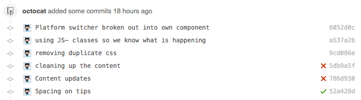
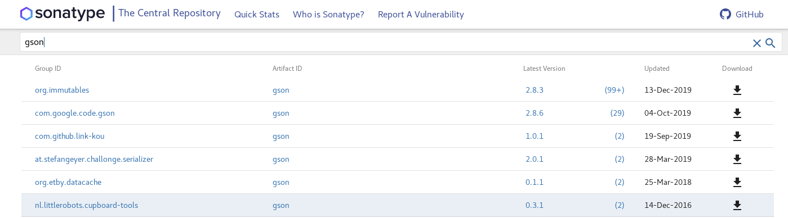
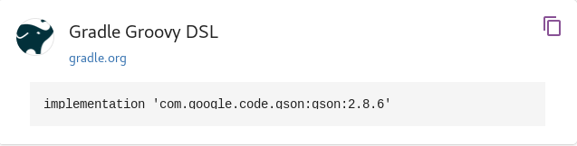

# OOP Task Verifier

This repository aimed to help you verify your task submission.  

Choose one of the paths:
1. [`Check your submission file`](#check-your-submission-file) > [`Move to Java layout - Using simple directory structure (1st method)`](#move-to-java-layout---using-simple-directory-structure-1st-method) > [`Upload your project to github`](#upload-your-project-to-github).

2. [`Check your submission file`](#check-your-submission-file) > [`Move to Java layout - Using Gradle (2nd method)`](#move-to-java-layout---using-gradle-2nd-method) > [`Upload your project to github`](#upload-your-project-to-github).

> ***Note: All your Java classes MUST have an empty constuctor (constuctor with no arguments) && Getters&Setters for each class attribute!See `tests/` directory and try it out***

## Table Of Content

- [Check your submission file](#check-your-submission-file)
- [Move to Java layout - Using simple directory structure (1st method)](#move-to-java-layout---using-simple-directory-structure-1st-method)
    - [Check your code for compilation](#check-your-code-for-compilation)
- [Move to Java layout - Using Gradle (2nd method)](#move-to-java-layout---using-gradle-2nd-method)
    - [1. Download gradle](#1-download-gradle)
    - [2. Unpack the distribution](#2-unpack-the-distribution)
        - [2.1.1 Linux & MacOS users](#211-linux--macos-users)
        - [2.1.2 Microsoft Windows users](#212-microsoft-windows-users)
    - [3. Configure your system environment](#3-configure-your-system-environment)
        - [3.1.1 Linux & MacOS users](#311-linux--macos-users)
        - [3.1.2 Microsoft Windows users](#312-microsoft-windows-users)
    - [4. Generate layout](#4-generate-layout)
        - [4.1.1 Linux & MacOS users](#411-linux--macos-users)
        - [4.1.2 Microsoft Windows users](#412-microsoft-windows-users)
    - [5. Test you did well](#5-test-you-did-well)
    - [6. Modify `build.gradle`](#6-modify-buildgradle)
        - [Test you did well](#test-you-did-well)
    - [7. Put your files in it](#7-put-your-files-in-it)
        - [Test you did well](#test-you-did-well-1)
    - [8. Add external libraries](#8-add-external-libraries)
- [Upload your project to github](#upload-your-project-to-github)
    - [1. Create git repository with github GUI](#1-create-git-repository-with-github-gui)
    - [2. Go to main directory](#2-go-to-main-directory)
    - [3. Init & push](#3-init--push)

## Check your submission file

The submission file should be as follows:  

```bash
<url for git clone>
<commit>
<ids>
```

For example - `submission_file.txt` [content](submission_file.txt):

```bash
https://github.com/Avielyo10/oop-dummy.git
f1de90bdb776222364d967d9b3bc7396ec053e0f
123456789_123456789
```

Run `check_submission`: `python check_submission.py <submission_file.txt>`.  
For example:

```bash
❯ python check_submission.py submission_file.txt

=== OUTPUT ===
git repository is: https://github.com/Avielyo10/oop-dummy.git
IDs are: 123456789_123456789
Commit: f1de90bdb776222364d967d9b3bc7396ec053e0f
```

See if the details are right, if not - fix your <submission_file>.  
Please put a valid git repository url - not `git@`/`gist`/`wiki`/etc. - if you can't `git clone <url for git clone>` then your repo is invalid - which means grade will be `0`.

### Check your code for compilation

1. Go to https://github.com/Avielyo10/oop-verifier.

2. On the right top click the `Fork` button.


3. The project is now at https://github.com/<YOUR_GITHUB_USERNAME>/oop-verifier.

4. Delete the **content** of `submission_file.txt` and put yours. Save it and push it to your repositry from above (`3.`).

5. Follow [github help manual to create a pull request from a fork](https://help.github.com/en/github/collaborating-with-issues-and-pull-requests/creating-a-pull-request-from-a-fork). The `base fork` is https://github.com/Avielyo10/oop-verifier and the `head fork` is https://github.com/<YOUR_GITHUB_USERNAME>/oop-verifier.

6. You will see an orange dot next to your pull request, that's mean that I'm checking your `submission_file.txt` and it's content. If it turns on to green `V` then it's all good, red `X` means something went wrong. You can click on it to see what went wrong with your project or if it succeeded. See the marks here (relates only to green `V` & red `X`):


## Move to Java layout - Using simple directory structure (1st method)

```bash
oop/ <-- (1)
├── resources.txt <-- (2)
└── src
    ├── main
    │   └── java
    │       └── Ex1 <-- (3)
    │           └── someClass.java <-- (4)
    └── test
        └── java
            └── Ex1 <-- (3)
                └── someClassTest.java <-- (5)
```

* (1) - Main directory, give it any name you want(just not `test`/`java`). From here you [initialize git](#3-init--push).

* (2) - `resources.txt` - when using external libraries you can choose either unzip the `jar` file into your project **or** write it on `resources.txt` as follows: Go to https://search.maven.org/ and search for your `jar` (for example: `gson`).  
Click on the version.  
On your right you'll see this:  
  
Copy and paste it as it is to `resources.txt` (**including the word `implementation`**) - Example in [`resources.txt`](resources.txt).

* (3) - Package name **is important**. For tasks 0 & 1, put your java classes under `Ex1`, for the 2nd task on `Ex2` and so on. On `src/test/java` you **MUST** use the same package names as `src/main/java`

* (4) - Java classes for tasks 0 & 1, they all should import `package Ex1;`, for task 2 import `package Ex2;` and so on.

* (5) - Junit class **MUST** have the same name ends with `Test` (see `(4)`) and of course **under the same package name!** See [`ComplexFunctionTest.java`](tests/Ex1/ComplexFunctionTest.java) for example.

See https://github.com/Avielyo10/oop-dummy

## Move to Java layout - Using Gradle (2nd method)

From now on your git repository must have the following layout:
(Looks scary but we will do it in baby steps, don't worry)

```bash
oop/
├── build.gradle
├── gradle
│   └── wrapper
│       ├── gradle-wrapper.jar
│       └── gradle-wrapper.properties
├── gradlew
├── gradlew.bat
├── settings.gradle
└── src
    ├── main
    │   ├── java
    │   │   └── oop
    │   │       └── App.java
    │   └── resources
    └── test
        ├── java
        │   └── oop
        │       └── AppTest.java
        └── resources
```

### 1. Download gradle

[Click here to download gradle to your computer.](https://gradle.org/next-steps/?version=5.6.2&format=all)

On MacOS - just run: `brew install gradle`.

### 2. Unpack the distribution

#### 2.1.1 Linux & MacOS users

Unzip the distribution zip file in the directory of your choosing, e.g.:

```bash
❯ mkdir /opt/gradle
❯ unzip -d /opt/gradle gradle-5.6.2-bin.zip
❯ ls /opt/gradle/gradle-5.6.2
LICENSE  NOTICE  bin  getting-started.html  init.d  lib  media
```

#### 2.1.2 Microsoft Windows users

Create a new directory `C:\Gradle` with `File Explorer`.

Open a second File Explorer window and go to the directory where the Gradle distribution was downloaded. Double-click the ZIP archive to expose the content. Drag the content folder `gradle-5.6.2` to your newly created `C:\Gradle` folder.

Alternatively, you can unpack the Gradle distribution ZIP into `C:\Gradle` using an archiver tool of your choice.

### 3. Configure your system environment

To run Gradle, the path to the unpacked files from the Gradle website need to be on your terminal’s path. The steps to do this are different for each operating system.

#### 3.1.1 Linux & MacOS users

Configure your `PATH` environment variable to include the bin directory of the unzipped distribution, e.g.:

```bash
❯ export PATH=$PATH:/opt/gradle/gradle-5.6.2/bin
```

Alternatively, you could also add the environment variable `GRADLE_HOME` and point this to the unzipped distribution. Instead of adding a specific version of Gradle to your `PATH`, you can add `$GRADLE_HOME/bin` to your `PATH`. When upgrading to a different version of Gradle, just change the `GRADLE_HOME` environment variable.

#### 3.1.2 Microsoft Windows users

In `File Explorer` right-click on the This PC (or Computer) icon, then click `Properties → Advanced System Settings → Environmental Variables`.

Under `System Variables` select `Path`, then click `Edit`. Add an entry for `C:\Gradle\gradle-5.6.2\bin`. Click `OK` to save.

Alternatively, you could also add the environment variable `GRADLE_HOME` and point this to the unzipped distribution. Instead of adding a specific version of Gradle to your `Path`, you can add `%GRADLE_HOME%/bin` to your `Path`. When upgrading to a different version of Gradle, just change the `GRADLE_HOME` environment variable.

### 4. Generate layout

#### 4.1.1 Linux & MacOS users

```bash
❯ mkdir oop
❯ cd oop/
❯ gradle init --type java-application
```

Select all the defaults (by pressing `Enter` on each step).

#### 4.1.2 Microsoft Windows users

Create `oop` directory move into it and run `gradle init --type java-application` using `cmd` or `powershell`.

Select all the defaults (by pressing `Enter` on each step).

### 5. Test you did well

```bash
❯ cd oop/
❯ gradle clean test

=== OUTPUT ===
BUILD SUCCESSFUL in 801ms
4 actionable tasks: 4 executed
```

Only the `BUILD <STATUS>` matters.

### 6. Modify `build.gradle`

```bash
oop/
├── build.gradle <-- This file over here
├── gradle
│   └── wrapper
│       ├── gradle-wrapper.jar
│       └── gradle-wrapper.properties
├── gradlew
├── gradlew.bat
├── settings.gradle
└── src
    ├── main
    │   ├── java
    │   │   └── oop
    │   │       └── App.java
    │   └── resources
    └── test
        ├── java
        │   └── oop
        │       └── AppTest.java
        └── resources
```

Go to `build.gradle` and delete all its conetnt, copy & paste this instead:

```groovy
plugins {
    // Apply the java plugin to add support for Java
    id 'java'
    id "com.gradle.build-scan" version "3.1.1"
}

repositories {
    // Use jcenter for resolving dependencies.
    // You can declare any Maven/Ivy/file repository here.
    jcenter()
}

dependencies {
    // This dependency is used by the application.
    implementation 'com.google.guava:guava:28.0-jre'
    implementation 'com.google.code.gson:gson:2.3.1'

    // Use JUnit test framework
    testImplementation 'org.junit.jupiter:junit-jupiter:5.5.2'
}
test {
    useJUnitPlatform()
    testLogging {
		events "passed", "skipped", "failed"
    }
}

buildScan {
    termsOfServiceUrl = 'https://gradle.com/terms-of-service'
    termsOfServiceAgree = 'yes'
}

```

You can also find it [here](build.gradle).

#### Test you did well

```bash
❯ gradle clean test

=== OUTPUT ===
BUILD SUCCESSFUL in 801ms
4 actionable tasks: 4 executed
```

### 7. Put your files in it

Go to `oop/src/main/java/`, create new directory `Ex1` (not - `eX1`/`ex1`/`EX1`/`Ex0`/etc.)  
Move your files there. Make sure that every Java class has `package Ex1;` line at the top.  

Now your layout should look something like that:

```bash
oop/
├── build.gradle
├── gradle
│   └── wrapper
│       ├── gradle-wrapper.jar
│       └── gradle-wrapper.properties
├── gradlew
├── gradlew.bat
├── settings.gradle
└── src
    ├── main
    │   ├── java
    │   │   ├── Ex1 <-- Right here
    │   │   │   ├── complex_function.java
    │   │   │   ├── cont_function.java
    │   │   │   ├── function.java
    │   │   │   ├── functions.java
    │   │   │   ├── Monom_Comperator.java
    │   │   │   ├── Monom.java
    │   │   │   ├── Operation.java
    │   │   │   ├── Polynom_able.java
    │   │   │   ├── Range.java
    │   │   │   └── StdDraw.java
    │   │   └── oop
    │   │       └── App.java
    │   └── resources
    └── test
        ├── java
        │   └── oop
        │       └── AppTest.java
        └── resources
```

#### Test you did well

```bash
❯ gradle clean test

=== OUTPUT ===
BUILD SUCCESSFUL in 801ms
4 actionable tasks: 4 executed
```

### 8. Add external libraries

See [Move to Java layout - Using simple directory structure (1st method)](#move-to-java-layout---using-simple-directory-structure-1st-method) on `resources.txt` (`(2)`).

## Upload your project to github

### 1. Create git repository with github GUI

[Click here](https://github.com/new)

### 2. Go to main directory

```bash
oop/ <-- This directory
├── build.gradle
├── gradle
│   └── wrapper
│       ├── gradle-wrapper.jar
│       └── gradle-wrapper.properties
├── gradlew
├── gradlew.bat
├── settings.gradle
└── src
    ├── main
    │   ├── java
    │   │   ├── Ex1
    │   │   │   ├── complex_function.java
    │   │   │   ├── cont_function.java
    │   │   │   ├── function.java
    │   │   │   ├── functions.java
    │   │   │   ├── Monom_Comperator.java
    │   │   │   ├── Monom.java
    │   │   │   ├── Operation.java
    │   │   │   ├── Polynom_able.java
    │   │   │   ├── Range.java
    │   │   │   └── StdDraw.java
    │   │   └── oop
    │   │       └── App.java
    │   └── resources
    └── test
        ├── java
        │   └── oop
        │       └── AppTest.java
        └── resources
```

### 3. Init & push

```bash
git init
git add .
git commit -m "<your commit message here>"
git remote add origin <your git repository>
git push -u origin master
```

Your project layout needs to look similarly to [this layout](https://github.com/Avielyo10/oop-dummy).
